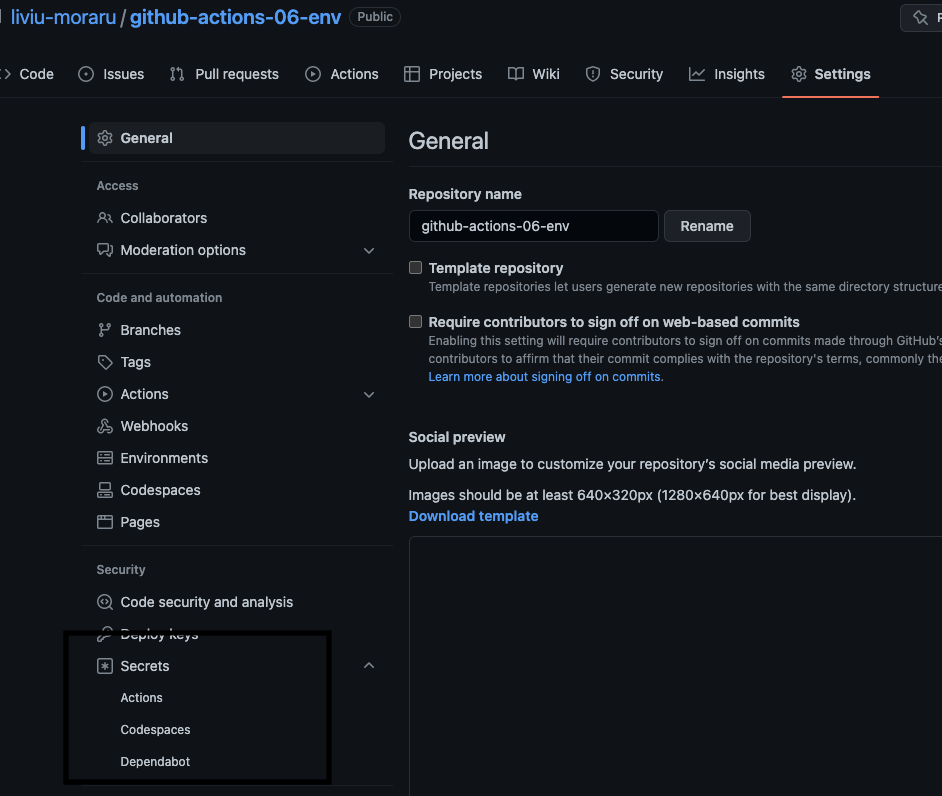

# Sectiunea 6. Using Environment Variables & Secrets

## Conexiune la MongoDB in cloud

- Am creat cont in cloud-ul MongoDb (user: liviu.moraru@gmail.com)
- 
User: liviu
Password: 5yiLcrf6LWJtPNrn
MONGODB_CLUSTER_ADDRESS: cluster0.iivyk6h.mongodb.net

Stringul de conectare: mongodb+srv://liviu:<password>@cluster0.iivyk6h.mongodb.net/?retryWrites=true&w=majority

## Variabilele de environment in workflow

- Pot fi definite la nivel de step, job sau workflow prin atributul env
- Accesate in workflow fie direct (in bash ca $VAR) sau prin context object ${{ env.VAR }}

## Default environment variables

[See](https://docs.github.com/en/actions/learn-github-actions/environment-variables#default-environment-variables)

## Using Secrets

- Secrets pot fi stocate in Github la nivel de organizatie sau la nivel de repository

### Stocare la nivel de repository

In Github -> Repo -> Settings -> Secrets -> Actions -> New secret



- Secreturile se referentiaza in workflow folosing context objectul secrets

```yaml
jobs:
  test:
    env:
      MONGODB_CLUSTER_ADDRESS: cluster0.iivyk6h.mongodb.net
      MONGODB_USERNAME: ${{ secrets.MONGODB_USERNAME }}
      MONGODB_PASSWORD: ${{ secrets.MONGODB_PASSWORD }}

```
